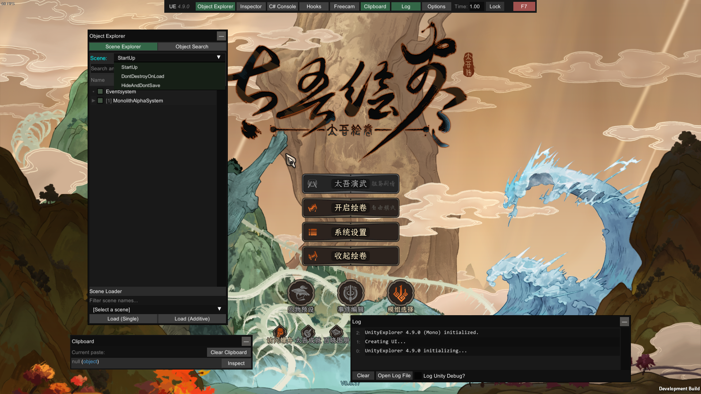

# 太吾绘卷MOD - UnityExplorerWrapper

将 [UnityExplorer](https://github.com/sinai-dev/UnityExplorer) 集成至游戏中以供研究和调试

</img>

## 安装
从Release中下载，解压至`/Mod`文件夹下即可  
（需要从steam或使用TaiwuLauncher.exe启动游戏，从另一exe启动游戏会导致报错）  
进入游戏后自动开启，按**F7**切换显示，注意启动后需选择Scene为DontDestroyOnLoad才是包含菜单的主界面

## 本地构建
使用VisualStudio导入.sln项目  
添加以下五个文件的索引
- `TaiwuModdingLib`
- `UnityEngine`
- `UnityEngine.CoreModule`  
    以上3个文件来自游戏目录下 `/The Scroll of Taiwu_Data/Managed`

- `UnityExplorer.STANDALONE.Mono`
- `UniverseLib.Mono`  
    以上2个文件从https://github.com/sinai-dev/UnityExplorer 下载Standalone - Mono版（解压到**非**游戏目录添加索引即可）

若要在游戏中测试，右键解决方案，生成，将得到的4个文件覆盖掉游戏目录下`/Mod/UnityExplorerWrapper/Plugins`内的文件即可（从Release中下载）。你也可以添加"后生成宏" 来解放你的双手